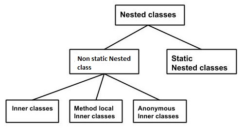
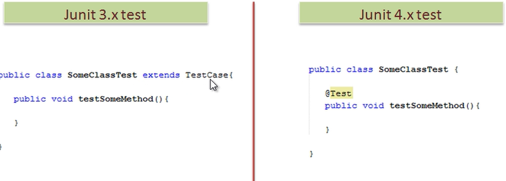
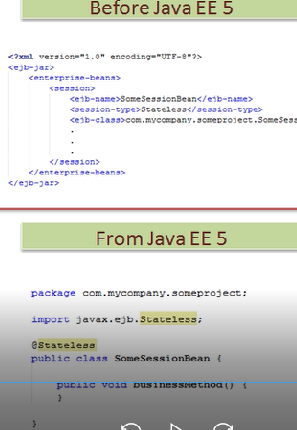

### Warmup ###
1. create maven java project by following command

	`mvn archetype:generate -DgroupId=com.javaaround -DartifactId=JavaAdvance -DarchetypeArtifactId=maven-archetype-quickstart -DinteractiveMode=false`

2. Update AppTest.java
	```java
	package com.javaaround;

	import org.junit.Test;;

	/**
	 * Unit test for simple App.
	 */
	/**
	 * Unit test for simple App.
	 */
	public class AppTest {
	   @Test
	   public void AppTest( ){
	        App.main(null);
	   }
	}
	```

3. Update junit version at pom.xml

	```xml
	<version>4.8.1</version>
	```

4. Run app by following command

	`mvn clean package`

### Nested Class ###

The Java programming language allows you to define a class within another class. Such a class is called a nested class

### Why Use Nested Classes ###

1. If a class is usefull to only one class, it makes sense to keep it nested and together.
2. It increases encapsulation.inner classes can access outer class private members and at the same time we can hide inner class from outer world.

3. It can lead to more readable and maintainable code

### Categories Nested Class ###



```java
class OuterClass {
    ...
    static class StaticNestedClass {
        ...
    }
    class InnerClass {
        ...
    }
}
```

### static nested class ###
A static class i.e. created inside a class is called static nested class in java. since it is static it can only access static thing

```java

package com.javaaround;

public class Outer {
    static int data=30;
    static class Inner{
        public void print() {
            System.out.println("static inner class" + data);
        }
    }

}
```
App.java

```java
public class App 
{
    public static void main( String[] args )
    {
        System.out.println( "Hello World!" );
        
        Outer.Inner inner = new Outer.Inner();
        inner.print();
    }
}
```
### Inner Class ###
Inner classes are class within Class,Unlike a class, an inner class can be private,protected since it is  treated like member of the outer class

```java
package com.javaaround;
public class Outer {
	//if private you can't outside
    public class Inner{
        public void print() {
            System.out.println("This is an inner class");
        }
    }

}
```
If you compile above code it will produce two class file.

```java
Outer.class
Inner$Outer.class
```
Note : We can’t directly execute the inner class’s .class file with java command.

### How to access Inner Class ###
1. Within outer class . update Outer.java

```java
//access in outer
    void display_Inner() {
      Inner inner = new Inner();
      inner.print();
    }  
```
1. Outside outer class . update App.java

```java
System.out.println( "Hello World!" );
// Instantiating the outer class 
Outer outer = new Outer();

// Accessing the display_Inner() method.
outer.display_inner();

Outer.Inner inner = outer.new Inner();
inner.print();
```

###  Method Local Inner Class ###
When an inner class is defined inside the method of Outer Class it becomes Method local inner class.

Method local inner class can be only instantiated within the method 

```java

package com.javaaround;

public class Outer {
    int count=10;
    public void display(){
        class Inner {        
            public void show(){
             System.out.println("Inside inner "+count);
            } 
       }

       Inner in=new Inner();
       in.show();
    }
}
```
App.java

```java
package com.javaaround;

/**
 * Hello world!
 *
 */
public class App 
{
    public static void main( String[] args )
    {
        System.out.println( "Hello World!" );
        
        Outer outer = new Outer();
        outer.display();
    }
}

```

### Anonymous Class ###

A class that have no name is known as anonymous class in java.it enable to making an instance of an object with certain "extras" such as overloading methods, without creating to actually subclass a class. Before creating anonymous class there must be `parent class` or `interace`.
<br/>
<b>Usecase : </b> Use them if you need to override the method of a class or an interface only once.

1. Usage in java sewing

	```java
	button.addActionListener(new ActionListener() {
	    @Override
	    public void actionPerformed(ActionEvent e) {
	        // do something
	    }
	});
	```
1. create Adder.java

	```java
	package com.javaaround;
	interface Adder{
	   public int add(int num1,int num2);
	}
	```	

2. Update App.java

	```java
	 Adder adder = new Adder(){
        	 public int add(int num1,int num2) {
        	 	return num1 + num2;
        	 }
        };
    System.out.println( "sum=" + adder.add(2,3));
	```	

3. Run app 

	`mvn clean package`	

### Nested Interface ###
```java
package com.javaaround;
interface Showable{  
  void show();  
  interface Message{  
   void msg();  
  }  
}    
```  
or

```java
package com.javaaround;
class Showable{  
  void show();  
  interface Message{  
   void msg();  
  }  
} 
```
or

```java
interface Showable{  
  class Message{  
   void msg();  
  }  
} 
```

update App.java

```java
package com.javaaround;

/**
 * Hello world!
 *
 */
public class App implements Showable.Message
{
    public void msg(){
      System.out.println("nested interface");
    }  
    public static void main( String[] args )
    {
        
       System.out.println( "Hello World!" );
        
       Showable.Message message=new App();//upcasting here  
       message.msg();  
    }
}

```

In collection frameword, sun microsystem has provided a nested interface Entry. Entry is the subinterface of Map i.e. accessed by Map.Entry.


### Generics  Benefits ###

1. Generics add stability to your code by making more of your bugs detectable at compile time.Without generic bugs are arise at runtime that more problematic to fixing.
2. Elimination of casts
```java
List<String> list = new ArrayList<String>();
list.add("hello");
//String s = (String)list.get(0); //without generic need cast
String s = list.get(0); // no cast
```
3. Enabling programmers to implement generic algorithms.

### Before Generics ###
```java
package com.javaaround;
public class Box {
    private Object object;

    public void set(Object object) { 
        this.object = object; 
    }
    public Object get() { 
        return object; 
    }
}
```
any object can pass but using generics you can inforce to specific type

update App.java

```java
Box box = new Box();
box.set(new Integer(10)); 
Integer s = (Integer)box.get();
System.out.println(s);
```

compile the class

`mvn clean compile`

### Using Generics ###
A class that can refer to any type is known as generic class.  generic class is delimited by angle brackets (<>), follows the class name.  Here, we are using T `type parameter` to create the generic class of specific type. Generics introduced in at java 5


```java
package com.javaaround;
public class Box<T> {
    private T t;

    public void set(T t) { 
        this.t = t; 
    }
    public T get() { 
        return t; 
    }
}
```

Now compile time error happens if type mismatch
```java
Box box<Integer> = new Box<Integer>();
box.set("shamim"); //compile time error
System.out.println(box.get());
```

compile the class

`mvn clean compile`

need to pass param only Integer

```java
Box<Integer> box = new Box<Integer>();
box.set(new Integer(12)); //no error now
System.out.println(box.get());
```        
compile the class

`mvn clean compile`

### Bounded Type ###
`Box<T extends Number>`

### Type Parameters naming conventions ###
The type parameters naming conventions are important to learn generics thoroughly. The commonly type parameters are as follows:

1. T - Type
2. E - Element
3. K - Key
4. N - Number
5. V - Value
6. S,U,V etc. - 2nd, 3rd, 4th types

### Apply Generics ###
In java, collections framework allow to write now generics style code.

Before generics
```java
List list = new ArrayList();  
list.add("hello");  
String s = (String) list.get(0);//typecasting  
```

After generics
```java

List<String> list = new ArrayList<String>();  
list.add("hello");  
String s = list.get(0);  

```

### Java 7 Type Inference ### 

From Java 7 the Java compiler can infer the type of the collection instantiated from the variable the collection is assigned to

 `List<String> strings = new ArrayList<>();`

 Notice that generic type of the ArrayList has been left out. Instead is only the <> written. This is also sometimes referred to as the `diamond operator`


### Generic Method ### 

 Like generic class, we can create generic method that can accept any type of argument.

 ```java
package com.javaaround;
public class Operation{  
  
   public static < E > void printArray(E[] elements) {  
        for ( E element : elements){          
            System.out.println(element );  
         }  
         System.out.println();  
    }  
}  
 ```

Update App.jva

 ```java
   Integer[] intArray = { 1, 2, 3, 4, 5 };
   Double[] doubleArray = { 1.1, 2.2, 3.3, 4.4 };
   Character[] charArray = { 'H', 'E', 'L', 'L', 'O' };

   System.out.println("Array integerArray contains:");
   Operation.printArray(intArray);   // pass an Integer array

   System.out.println("\nArray doubleArray contains:");
   Operation.printArray(doubleArray);   // pass a Double array

   System.out.println("\nArray characterArray contains:");
   Operation.printArray(charArray);   // pass a Character array
 ```

### Bounded Type Parameters ###

Requirements : counts the number of elements in an array T[] that are greater than a specified element elem.

```java
public static <T> int countGreaterThan(T[] anArray, T elem) {
    int count = 0;
    for (T e : anArray)
        if (e > elem)  // compiler error
            ++count;
    return count;
}
```
it does not compile because the greater than operator (>) applies only to primitive types such as short, int, double, long, float, byte, and char.

To fix the problem, use a type parameter bounded by the Comparable<T> interface:

```java
public static <T extends Comparable<T>> int countGreaterThan(T[] anArray, T elem) {
    int count = 0;
    for (T e : anArray)
        if (e.compareTo(elem) > 0)
            ++count;
    return count;
}
```
### Upper Bounded Wildcard  ###

 The ? (Question Mark) symbol represents wildcard element. It means any type. If we write <? extends Number>, it means any child class of Number e.g. Integer, Float, double etc

 Shape.java
 ```java
package com.javaaround;

import java.util.*;  
abstract class Shape{  
    abstract void draw();  
}  
 ```

 Rectangle.java
 ```java
package com.javaaround;
class Rectangle extends Shape{  
    void draw(){
        System.out.println("drawing rectangle");
    }  
} 
 ```

 Update App.java

 ```java
package com.javaaround;
import java.util.*;
/**
 * Hello world!
 *
 */
public class App 
{
    public static void drawShapes(List<? extends Shape> lists){  
      for(Shape s:lists){  
          s.draw();
      }  
    }  
    public static void main( String[] args )
    {
        
       System.out.println( "Hello World!" );
       List<Rectangle> list1=new ArrayList<Rectangle>();  
       list1.add(new Rectangle());
       drawShapes(list1);    
    }
}

 ```
### Lower Bounded Wildcard  ###
To write the method that works on lists of Integer and the supertypes of Integer, such as Integer, Number, and Object, you would specify List<? super Integer>.

```java
public static void addNumbers(List<? super Integer> list) {
    for (int i = 1; i <= 10; i++) {
        list.add(i);
    }
}
```
### UnBounded Wildcard  ###

Update App.java

```java
public class App 
{
    public static void printList(List<?> list) {
        for (Object elem: list)
            System.out.print(elem + " ");
        System.out.println();
    } 
    public static void main( String[] args )
    {
        
       System.out.println( "Hello World!" );
      List<Integer> li = Arrays.asList(1, 2, 3);
      List<String>  ls = Arrays.asList("one", "two", "three");
      printList(li);   
      printList(ls);   
    }
}

```

### Annotation  ###

1. Used to associate metadata(some extra info) into source code which can be used by java compiler and JVM.
2. Introduce to java 5
3. Simple to use compare to metadata using xml 

### Built-In Java Annotations ###
1. @Override
2. @SuppressWarnings
3. @Deprecated
4. @Target
5. @Retention
6. @Inherited
7. @Documented

###  @Override ###
@Override annotation assures that the subclass method is overriding the parent class method. If it is not so, compile time error occurs.

###  @SuppressWarnings ###
is used to suppress(remove) warnings issued by the compiler.

Update App.java

```java
 ArrayList list=new ArrayList();  
 list.add("A");  
 list.add("B");  
 list.add("C");  
  
 for(Object obj:list)  
 System.out.println(obj);
```
compile the class

`mvn clean compile`

gives `uses unchecked or unsafe operations.` warning because it use non generic collection

For removing this type of warning @SuppressWarnings is used

Now. App.java
```java
@SuppressWarnings("unchecked")
public static void main( String[] args )

```

compile the class again

`mvn clean compile`

Now warning has been gone

### @Deprecated ###

@Deprecated annoation marks that this method is deprecated so compiler prints warning. It informs user that it may be removed in the future versions. So, it is better not to use such methods.

```java
package com.javaaround;
class A{  
  @Deprecated  
  void n(){
    System.out.println("hello n");
  }  
}  
```

Update App.java
```java
A a=new A();  
a.n();  
```
compile the class 

`mvn clean compile`

givs Note: Test.java uses or overrides a deprecated API. warning

### Example Junit ###



### Example EJB ###



### Custom Annotation ###

```java
<modifier> @interface <annotation-name>{
  //body
}
```

There are three types of annotations.

1. Marker Annotation : has no method e.g @Override and @Deprecated
2. Single-Value Annotation : has one method
3. Multi-Value Annotation :  more one method

### Allow annotation types ###
1. Primitive types(int , double etc)
2. java.lang.String
3. java.lang.Class
4. Enum
5. Another annotation type
6. Array of above types String[],int[]

Example | Usage
-------------- | -------------
String skils[]    | skils{"java","php"} ,if one value skils="php"
Class provider()   | provider=Someprovider.class
Remark remark()     |
public enum Remarks{ | remark = Remark.GOOD
  "GOOD","BAD"        |
}                     |


1. create MyAnnotation.java
```java
package com.javaaround;
import java.lang.annotation.*;  
import java.lang.reflect.*;  
  
@Retention(RetentionPolicy.RUNTIME)  
@Target(ElementType.METHOD)  
@interface MyAnnotation{  
  int value(); 
  //use default keyword if you provide value
  String value2() default "xyz";   
}  
```

@Target is used to specify at which level, the annotation is allow other can't use it.

ElementType | Allow
----------------- | -------------
ElementType.METHOD  | Only allow methods level used
ElementType.FIELD  | Only allow field level used
ElementType.TYPE  | Only allow class,interface,enum level used
ElementType.CONSTRUCTOR  | Only allow CONSTRUCTOR level used
ElementType.LOCAL_VARIABLE  | Only allow LOCAL_VARIABLE level used
ElementType.ANNOTATION_TYPE  | Only allow ANNOTATION_TYPE level used
ElementType.PARAMETER  | Only allow PARAMETER level used

you can use multiple value 

`@TargetElementType.METHOD,ElementType.FIELD)`

@Retention is used to specify to what level annotation will be available

RetentionPolicy | Availability
----------------- | -------------
RetentionPolicy.SOURCE | refers to the source code, discarded during compilation
RetentionPolicy.CLASS | available to java compiler but not to JVM
RetentionPolicy.RUNTIME | available to java compiler and JVM

1. Usage of MyAnnotaton
```java
package com.javaaround;

class Hello{  
  //@MyAnnotation(value=10,value1="shamim")
  @MyAnnotation(value=10)  
  public void sayHello(){
    System.out.println("hello annotation");
  }  
}
```
2. Access of MyAnnotaton

update App.java

```java
try{ 
  Hello h=new Hello();  
  Method m=h.getClass().getMethod("sayHello");  
    
  MyAnnotation manno=m.getAnnotation(MyAnnotation.class);  
  System.out.println("value is: "+manno.value()+ "," +manno.value1());
}catch(Exception e){
  
}    
```

OR Access all annotation of method

```java
try{ 
    Class<Hello> c = Hello.class;
    Annotation[] annotations = c.getDeclaredMethod("sayHello").getAnnotations();
    for(Annotation annotation : annotations){
      
      if(annotation instanceof MyAnnotation){
        MyAnnotation manno = (MyAnnotation) annotation;
        System.out.println("value is: "+manno.value() + "," +manno.value1());
      }
    }
  }catch(Exception e){

  }
```

if you need all annotation of class level(Type)
```java
Annotation[] annotations = c.getAnnotations();
```

### @Inherited ###
By default, custom annotations are not inherited to subclasses as a result you can't use it into subclasses.The @Inherited annotation marks the annotation to be inherited to subclasses.

```java
@Inherited 
@interface MyAnnotation{  
  int value();  
}  
```

### @Documented ###

The @Documented Marks the annotation for inclusion in the documentation


### Enum ###
Enum  is a special data type that contains fixed set of constants. it was introduced in JDK 1.5 

### Benefits Enum ###
1. <b>Enum is type-safe</b> you can not assign anything else other than predefined Enum constants to an Enum variable
2. Enum can be used at Switch statement like int or char primitive data type
3. Adding new constants on Enum in Java is easy and you can add new constants without breaking the existing code


